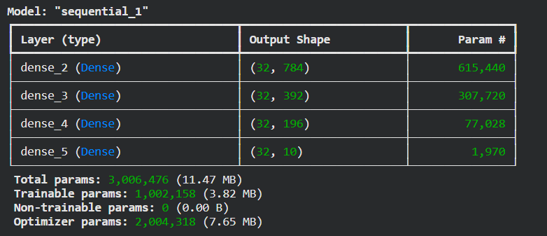
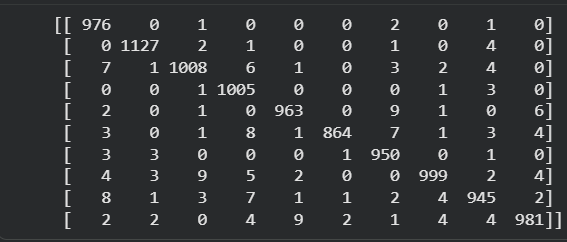
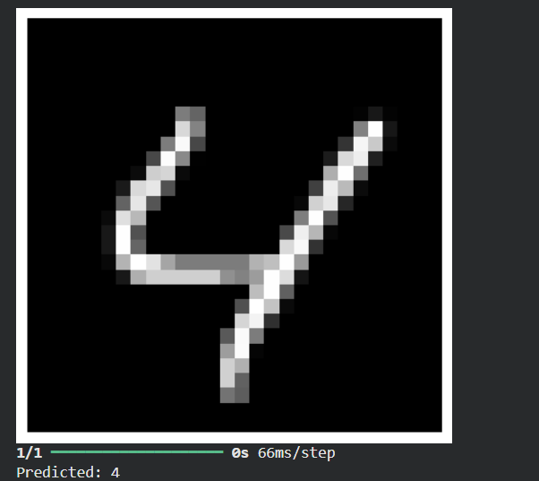

# ✍️ Handwritten Digit Classification using ANN

## 📖 Project Overview

This project demonstrates handwritten digit recognition using an Artificial Neural Network (ANN) trained on the MNIST dataset. The model classifies grayscale images of handwritten digits (0–9) and predicts the correct digit with high accuracy.

The project covers the complete deep learning workflow, including data preprocessing, model development, training, evaluation, visualization, and prediction on custom handwritten digit images.

---

## 🚀 Features

- Load and preprocess the MNIST dataset
- Normalize image pixel values
- Reshape image data for ANN input
- One-hot encode target labels
- Build an Artificial Neural Network (ANN)
- Train and validate the model
- Evaluate performance using multiple metrics
- Predict handwritten digits from test images
- Predict custom handwritten digit images
- Save the trained model

---

## 🛠 Technologies Used

- Python
- TensorFlow
- Keras
- NumPy
- Matplotlib
- Scikit-learn
- Google Colab

---

## 📂 Dataset

**MNIST Handwritten Digit Dataset**

- 70,000 grayscale images
- Image size: 28 × 28 pixels
- Classes: Digits 0–9

---

## 🤖 Model Architecture

- Input Layer (784 neurons)
- Hidden Dense Layers
- ReLU Activation Function
- Softmax Output Layer

---

## 📊 Model Evaluation

The model was evaluated using:

- Accuracy Score
- Classification Report
- Confusion Matrix
- Sample Predictions
- Custom Handwritten Digit Prediction

---

## 📸 Project Screenshots

### Model Summary



### Sample Predictions


### Confusion Matrix



### Custom Handwritten Digit Prediction



---

## ▶️ How to Run

1. Clone the repository.

```bash
git clone <your-github-link>
```

2. Install dependencies.

```bash
pip install -r requirements.txt
```

3. Open the notebook in Google Colab or Jupyter Notebook.

4. Run all cells.

5. Upload your own handwritten digit image to test the trained model.

---

## 📌 Future Improvements

- Improve accuracy using Convolutional Neural Networks (CNN)
- Deploy the model using Flask or Streamlit
- Build a web interface for digit recognition
- Support real-time digit recognition

---

## 👨‍💻 Author

**Aayush **

---

## ⭐ If you found this project useful, consider giving it a star on GitHub!
